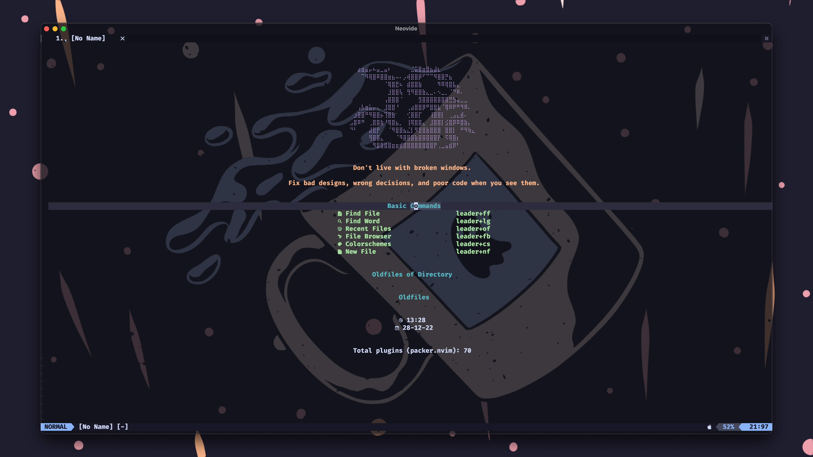
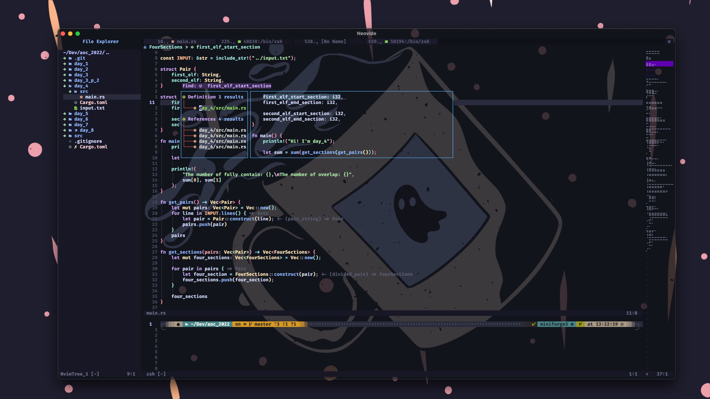
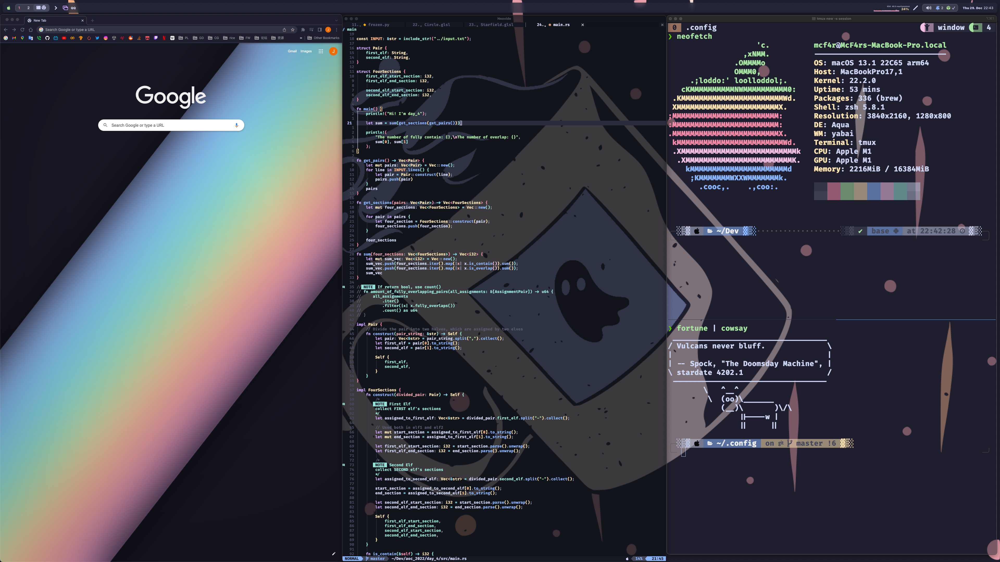

<div align="center">
 <h1> BetterNvim </h1>
 <a href="https://github.com/ye-junzhe/BetterNvim/#Installation">📦 Installation</a>
</div>

## Preview





# Demo 🎥
<details>
  <summary>Start screen</summary>
  <video src="./video/Start.mov" controls></video>
</details>

<details>
  <summary>Mason</summary>
  <video src="./video/Mason_for_lsp.mov" controls></video>
</details>

<details>
  <summary>Treesitter</summary>
  <video src="./video/Treesitter_for_highlight.mov" controls></video>
</details>

<details>
  <summary>Bufferline</summary>
  <video src="./video/Switch_between_tabs.mov" controls></video>
</details>

<details>
  <summary>Todo Tree</summary>
  <video src="./video/TodoTree.mov" controls></video>
</details>

<details>
  <summary>Telescope</summary>
  <video src="./video/Telescope.mov" controls></video>
</details>

<details>
  <summary>Minimap</summary>
  <video src="./video/Minimap.mov" controls></video>
</details>

<details>
  <summary>Tagbar</summary>
  <video src="./video/Tagbar.mov" controls></video>
</details>

<details>
  <summary>Hop</summary>
  <video src="./video/Hop.mov" controls></video>
</details>

This repo is to setup a modern IDE for coding in neovim **(Mainly for macOS, if run on windows, needs some modifications ([see here](https://github.com/ye-junzhe/BetterNvim#:~:text=%3CD%2D%3E%20%3D%20Command%20on%20macOS%2C%20and%20it%20only%20works%20in%20neovide%2C%20changes%20needed%20if%20running%20on%20windows)))**

With more than 70 plugins installed

Still developing, so there are many commented out lines for future adjustment

- VSCode-like Auto-completion setup
- Mason for native neovim LSP management
- treesitter for highlighting
- Plugins: bufferline, lualine, nvim-tree, navic, noice, vimspector, todotree ...
- colorscheme : catppuccin
- special setup for Rust development
- **[Neovide](https://neovide.dev/) HIGHLY recommended**
- The `<leader>` key has been changed to `<space>`

## Installation

### Automatically

To **Install** neovim run this command:
(make sure you have git and bash installed before running)

```bash
curl -s https://raw.githubusercontent.com/ye-junzhe/BetterNvim/master/install.sh | bash -s
```

### Manual

Install it manually by:

**Optional**: Backup existing nvim config

```bash
mv $HOME/.config/nvim $HOME/.config/nvim.old
```

**Mandatory**

1. Cloning the repository

```bash
git clone https://github.com/ye-junzhe/BetterNvim.git $HOME/.config/nvim
```

2. Installing the Plugins

```bash
nvim +PackerSync
```

Most Keybindings at [keymaps.lua](https://github.com/ye-junzhe/BetterNvim/blob/master/lua/Junzhe/core/keymaps.lua)

The rest of the settings are in the corresponding lua file of the plugin

`<D->` = `Command` on macOS, and it only works in neovide, changes needed if running on windows

<style>
  details summary {
    font-size: 1.3em;
    color: #A6E3A1;
    background-color: #1E1E2E;
  }
  details {
    border: 1px solid #1E1E2E;
  }
</style>

<script>
  document.querySelectorAll("details").forEach(function(details) {
    details.querySelector("summary").addEventListener("click", function() {
      details.open = !details.open;
    });
  });
</script>
